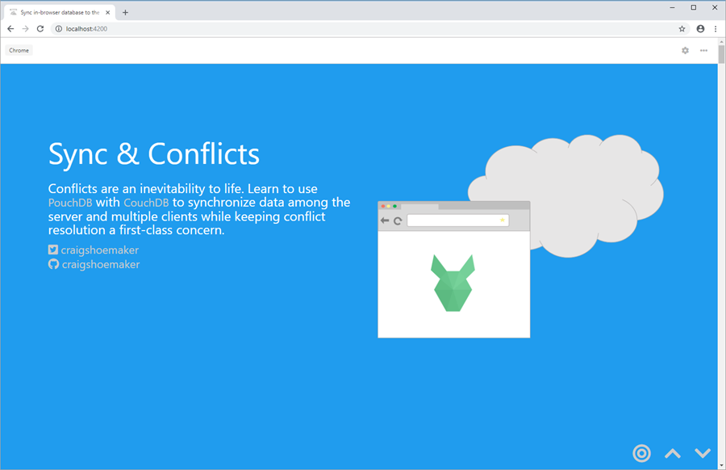

# Client to the Cloud



## Setup

After you clone the repo to your machine, install the application dependencies using `npm`.

```bash
npm install
```

## Start

This application is created using the Angular CLI. To start the application, the `npm start` script is mapped to the Angular CLI `serve` command.

```bash
npm start
```

## Secrets

Server credentials are read from a file named *secrets.json*. An example file named *secrets.json.example* is included in the repository. To use this file, rename it by removing the *.example* extension and add your values in place of the replacement tokens in the example file. 

The contents of *secrets.json.example* are as follows:

```javascript
{
    "local": {
        "username": "<USER_NAME>",
        "password": "<PASSWORD>",
        "host": "localhost",
        "port": 5984
    },
    "azure": {
        "username": "<USER_NAME>",
        "password": "<PASSWORD>",
        "host": "<APP_NAME>.<REGION>.cloudapp.azure.com",
        "port": 5984
    }
}
```

## Intent

This application is built with for the sole purpose for presenting the *Client to the Cloud* talk. While you may learn about how to use [PouchDB](http://pouchdb.com) from this application, much of the code is implemented specifically for presenting to an audience. Make sure to [read the docs](https://pouchdb.com/guides/) for guidance on how to best use PouchDB.


## Resource

- [PouchDB](http://pouchdb.com)
- [CouchDB](http://couchdb.apache.org/)
- [Bitnami CouchDB Stack For Microsoft Azure](https://docs.bitnami.com/azure/infrastructure/couchdb/)
- [12 pro tips for better code with PouchDB](https://pouchdb.com/2014/06/17/12-pro-tips-for-better-code-with-pouchdb.html)